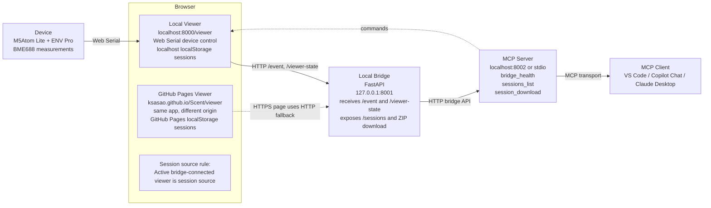

# Scent

Realtime gas sensing and visualization with **M5Atom Lite + ENV Pro (BME688)**.

This repository contains:
- Arduino firmware to read BME688 data (heater profile / gas index 0-9)
- A static browser viewer served from either localhost or GitHub Pages
- A local bridge service that connects the browser viewer, MCP server, and automation tools
- An MCP server that exposes bridge controls to VS Code / agent workflows

## Repository Layout

```
Arduino/
	Scent/
		Scent.ino         # M5Atom + BME688 firmware
bridge/
	server.py          # FastAPI bridge on localhost:8001
	mcp_server.py      # MCP adapter on localhost:8002 or stdio
docs/
	viewer/            # Static Web Serial viewer (localhost or GitHub Pages)
Python/
	serial_plot.py      # Flask + serial reader + logger
	templates/index.html
	requirements.txt
	logs/               # Runtime-generated raw logs
	data/               # Runtime-generated aggregated CSV
```

## Current Architecture

The current browser + bridge + MCP topology is shown below.



Key points:
- The browser viewer can be served from `http://localhost:8000/viewer/` or `https://ksasao.github.io/Scent/viewer/`.
- The device connects to the browser viewer by Web Serial, not directly to the bridge.
- The bridge runs locally on `http://127.0.0.1:8001` and receives viewer events, commands, and viewer-state snapshots.
- The MCP server runs on `127.0.0.1:8002` (or stdio) and talks to the bridge, not to the browser directly.
- A session means the dataset created when the user presses `Start Session` in the viewer.
- When the viewer is connected to the bridge, the bridge uses the currently connected viewer's localStorage-backed session list as the source for `sessions_list` and session ZIP downloads.

### Port Map

- `8000`: local static viewer hosting
- `8001`: local bridge API / WebSocket endpoint
- `8002`: MCP server

### Session Source Rules

- If the active viewer is `localhost:8000/viewer`, downloads come from the localhost viewer's localStorage sessions.
- If the active viewer is GitHub Pages, downloads come from the GitHub Pages viewer's localStorage sessions.
- Switching the active bridge-connected viewer changes which session list MCP sees.
- The bridge reports the active source origin via `/health` as `viewer_state_origin`.

For bridge-specific setup and API details, see `bridge/README.md`.

## Features

### Arduino (`Arduino/Scent/Scent.ino`)
- Reads BME688 in parallel mode with a 10-step heater profile
- Outputs channel data for gas index `0-9`
- Supports `id` command over serial and returns sensor unique ID (`ID,<8-hex>`) 
- Hot-plug recovery: retries BME688 reinitialization on communication errors
- Watchdog reset if no valid measurement is received for 10 seconds
- Appends **CRC-8** (AUTOSAR polynomial `0x31`) to each data line

### Python (`Python/serial_plot.py`)
- Reads serial data from COM port (`115200` by default)
- Validates incoming lines with the same **CRC-8** algorithm
- Realtime web graph (Chart.js) for channels `D0-D9`
- X-axis uses **relative time in seconds** based on Python receive time
- Reset button for baseline/delta mode
- Auto-reconnect for COM disconnects with exponential backoff
- Logs raw serial lines and writes aggregated rows on D9 timing
- Windows desktop launcher via embedded WebView2

## Serial Data Format

Data lines sent from Arduino:

```
index,temp,humidity,pressure,current,crc
```

Example:

```
3,24.71,42.51,100842.89,10.337,A4
```

Notes:
- `index`: `0-9` (gas heater step / channel)
- `current`: `log(gas_resistance)` with 3 decimals
- `crc`: CRC-8 over the text before the final comma

## Python App Setup

### Requirements
- Python 3.10+ recommended
- Windows COM serial environment

Install dependencies:

```powershell
cd Python
python -m pip install -r requirements.txt
```

## Run

Start with explicit COM port:

```powershell
cd Python
python serial_plot.py --port COM3 --baudrate 115200 --host 127.0.0.1 --web-port 5000
```

Or run without `--port`:

```powershell
cd Python
python serial_plot.py
```

When `--port` is omitted:
- If the last successfully communicating COM port exists, it is auto-selected at startup.
- Otherwise, the app starts disconnected and COM selection/connection is done from the browser UI.
- Interactive COM selection in the command line is not used.

Open in browser:

```
http://127.0.0.1:5000
```

Desktop mode on Windows 11:

```powershell
cd Python
python desktop_main.py --port COM3
```

Build distributable EXE:

```powershell
cd Python
py -m pip install -r requirements.txt
py make_icon.py
py -m PyInstaller --noconfirm --clean --windowed --onedir --name Scent --icon Scent.ico --add-data "templates;templates" --add-data "static;static" --collect-all webview desktop_main.py
```

The distributable output is created under `Python/dist/Scent/`.

## Runtime Outputs

- Raw log files: `Python/logs/YYYYMMDD_HHMMSS.csv`
	- Format: `python_timestamp,raw_serial_line`
- Aggregated files: `Python/data/YYYYMMDD_HHMMSS.csv`
	- Header: `date,temperature,humidity,pressure,d0,d1,...,d9`
	- One row is emitted when channel `9` is received

## Web API (used by UI)

- `GET /` : dashboard
- `GET /data` : latest plot payload
- `POST /reset` : set current values as baseline
- `GET /id` : request sensor unique ID over serial
- `GET /api/ports` : list available COM ports
- `POST /api/connect/<port>` : connect to specified COM port
- `POST /api/disconnect` : disconnect current COM port

## Arduino Build Notes

Required libraries:
- `M5Atom`
- `Bosch BME68x` library (`bme68xLibrary.h`)

I2C pins used by firmware:
- `SDA = 26`
- `SCL = 32`
- BME688 I2C address: `0x77`

## License

See `LICENSE`.
