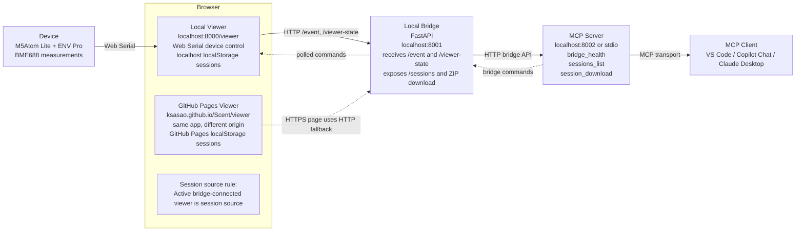

# Scent

Realtime gas sensing and visualization with **M5Atom Lite + ENV Pro (BME688)**.

This repository contains:
- Arduino firmware to read BME688 data (heater profile / gas index 0-9)
- A static browser viewer served from either localhost or GitHub Pages
- A local bridge service that connects the browser viewer, MCP server, and automation tools
- An MCP server that exposes bridge controls to VS Code / agent workflows

## Repository Layout

```
Arduino/
	Scent/
		Scent.ino                    # M5Atom Lite + BME688 firmware
		build/                       # Compiled hex files

bridge/                              # Python FastAPI bridge service
	server.py                        # FastAPI on localhost:8001
	mcp_server.py                    # MCP adapter on localhost:8002 or stdio
	config.py                        # Configuration and env var loading
	requirements.txt                 # Python dependencies (FastAPI, uvicorn, mcp, etc.)
	README.md                        # Bridge API documentation

docs/
	index.html                       # Main documentation index
	viewer/                          # Static Web Serial viewer (localhost:8000 + GitHub Pages)
		index.html                   # Viewer app entry point
		js/
			core.js                  # State management, session persistence
			bridge.js                # Bridge connectivity & auto-detection
			device.js                # Web Serial device handling
		css/
			style.css                # Viewer styles
	firmware/                        # Web firmware flasher for browser
		flasher.js                   # ESP32 flash download mode integration
		manifest.json                # Web app manifest
	architecture-overview.svg        # System architecture diagram (legacy)

Python/                              # Utility scripts
	make_icon.py                     # Icon generation utility
	sync_firmware_assets.py          # Sync firmware assets to docs/firmware/
	requirements.txt                 # (legacy/unused)
	README.md                        # Legacy setup notes
	venv/                            # Python virtual environment

WebFlasher/                          # Alternative firmware flasher (standalone)
	index.html                       # Flasher entry point
	flasher.js                       # Flash algorithm
	manifest.json                    # Web app manifest
	style.css                        # Flasher styles
	firmware/                        # Firmware binary directory

apps/
	latest/                          # App release artifacts
		download/                    # Latest executable downloads

LICENSE                              # Apache License 2.0
README.md                            # This file
```

## Current Architecture

The current browser + bridge + MCP topology is shown below.



Key points:
- The browser viewer can be served from `http://localhost:8000/viewer/` or `https://ksasao.github.io/Scent/viewer/`.
- The device connects to the browser viewer by Web Serial, not directly to the bridge.
- The bridge runs locally on `http://127.0.0.1:8001` and receives viewer events, commands, and viewer-state snapshots.
- The MCP server runs on `127.0.0.1:8002` (or stdio) and talks to the bridge, not to the browser directly.
- Viewer command execution also flows through the bridge: MCP Server -> Bridge -> Viewer polling `/commands/pending`.
- A session means the dataset created when the user presses `Start Session` in the viewer.
- When the viewer is connected to the bridge, the bridge uses the currently connected viewer's localStorage-backed session list as the source for `sessions_list` and session ZIP downloads.

### Port Map

- `8000`: local static viewer hosting
- `8001`: local bridge API / WebSocket endpoint
- `8002`: MCP server

### Session Source Rules

- If the active viewer is `localhost:8000/viewer`, downloads come from the localhost viewer's localStorage sessions.
- If the active viewer is GitHub Pages, downloads come from the GitHub Pages viewer's localStorage sessions.
- Switching the active bridge-connected viewer changes which session list MCP sees.
- The bridge reports the active source origin via `/health` as `viewer_state_origin`.

For bridge-specific setup and API details, see `bridge/README.md`.

## Features

### Arduino (`Arduino/Scent/Scent.ino`)
- Reads BME688 in parallel mode with a 10-step heater profile
- Outputs channel data for gas index `0-9`
- Supports `id` command over serial and returns sensor unique ID (`ID,<8-hex>`) 
- Hot-plug recovery: retries BME688 reinitialization on communication errors
- Watchdog reset if no valid measurement is received for 10 seconds
- Appends **CRC-8** (AUTOSAR polynomial `0x31`) to each data line

### Viewer (`docs/viewer/`)
- Static HTML/JS Web Serial viewer
- Served from `http://localhost:8000/viewer/` (local development) or `https://ksasao.github.io/Scent/viewer/` (GitHub Pages)
- Per-origin localStorage session storage (localhost sessions separate from GitHub Pages sessions)
- Auto-detects bridge URL from localhost:8001 candidates
- Syncs viewer state to bridge via `/viewer-state` POST
- Session lifecycle: created when user presses "Start Session", downloaded as ZIP via bridge

## Getting Started

### Prerequisites
- Arduino IDE with M5Atom Lite board support
- Python 3.8+ for bridge and utilities
- Modern web browser (Chrome/Edge 90+) for Web Serial API support

### Setup Bridge (FastAPI + MCP)

```powershell
cd bridge
python -m pip install -r requirements.txt
python server.py          # Runs on http://127.0.0.1:8001
```

In another terminal:

```powershell
cd bridge
python mcp_server.py --transport stdio     # Or --transport streamable-http --port 8002
```

### Setup Viewer

Local development (with live reload):

```powershell
cd docs/viewer
python -m http.server 8000
```

Then open `http://localhost:8000/viewer/` in your browser.

### Upload Firmware

**Option 1: Browser-based Web Flasher (Recommended, no Arduino IDE required)**

1. Connect M5Atom Lite via USB
2. Open https://ksasao.github.io/Scent/ in your browser
3. Use the Web Flasher to upload the firmware directly to the device

**Option 2: Arduino IDE**

1. Connect M5Atom Lite via USB
2. Open `Arduino/Scent/Scent.ino` in Arduino IDE
3. Select board: **M5Atom Lite**
4. Select COM port and upload

### Use the Viewer

1. Open https://ksasao.github.io/Scent/viewer/ in your browser (or `http://localhost:8000/viewer/` for local development)
2. Click "Connect" and select M5Atom Lite from Web Serial port list
3. Press "Start Session" to begin recording
4. Data saves to browser localStorage (separate per origin)
5. Download session as ZIP via the UI
- `GET /id` : request sensor unique ID over serial
- `GET /api/ports` : list available COM ports
- `POST /api/connect/<port>` : connect to specified COM port
- `POST /api/disconnect` : disconnect current COM port

## Arduino Build Notes

Required libraries:
- `M5Atom`
- `Bosch BME68x` library (`bme68xLibrary.h`)

I2C pins used by firmware:
- `SDA = 26`
- `SCL = 32`
- BME688 I2C address: `0x77`

## License

See `LICENSE`.
